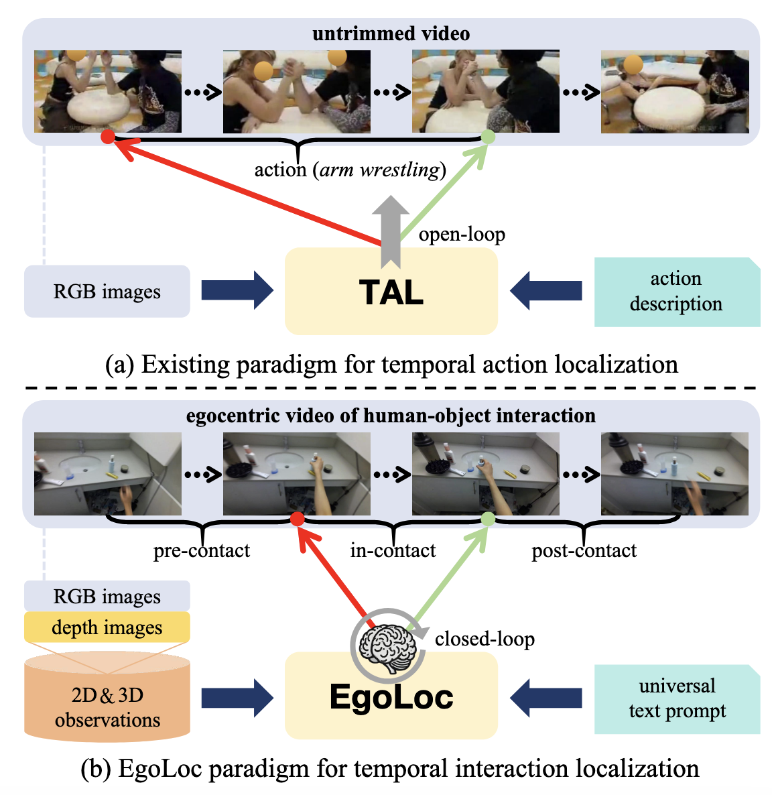
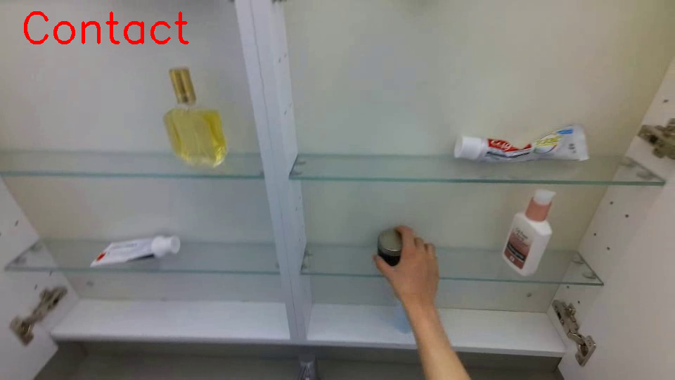
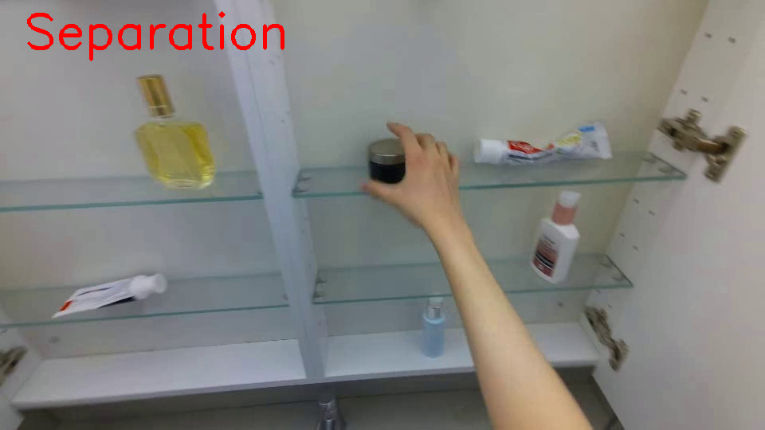
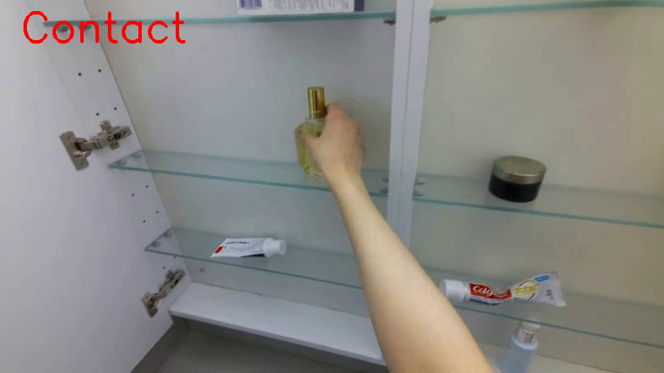
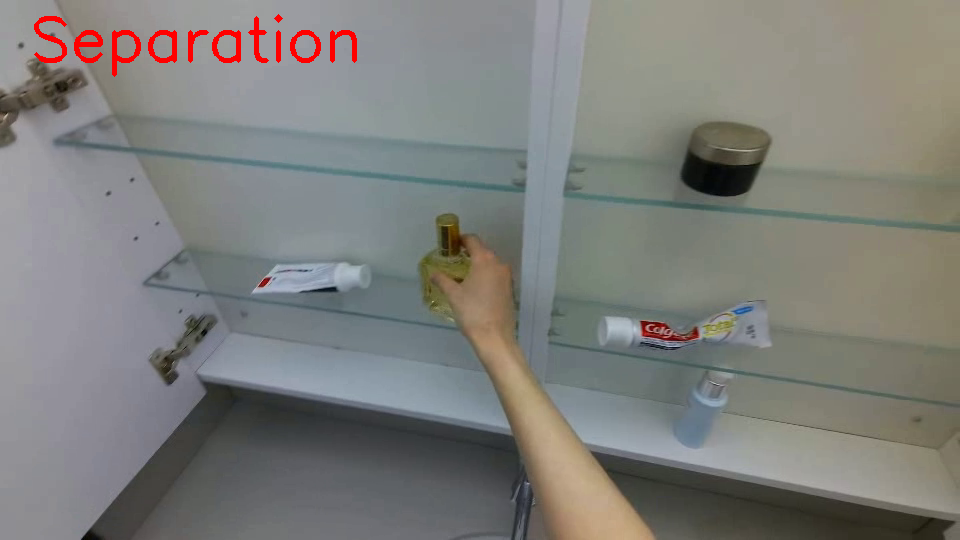

# EgoLoc: Zero-Shot Temporal Interaction Localization for Egocentric Videos

Authors: [Erhang Zhang#](https://scholar.google.com/citations?user=j1mUqHEAAAAJ&hl=en), [Junyi Ma#](https://github.com/BIT-MJY), [Yin-Dong Zheng](https://dblp.org/pid/249/8371.html), [Yixuan Zhou](https://ieeexplore.ieee.org/author/37089460430), [Hesheng Wang*](https://scholar.google.com/citations?user=q6AY9XsAAAAJ&hl)

<div align="center">
 
</div>


EgoLoc is a VLM-based paradigm to localize **the hand-object contact/separation timestamps** for egocentric videos in a zero-shot manner. We therefore extend the coarse *temporal action localization (TAL)* to finer-grained *temporal interaction localization (TIL)*. [Our paper](https://arxiv.org/abs/2506.03662) has been accepted by IROS 2025.

<div align="center">
 <h3>
 from <font color="blue">[🧭TAL]</font> to <font color="red">[🎯TIL]</font>
 </h3>

 
</div>

## 1. How to Use

We provide two demos from the [EgoPAT3D-DT dataset](https://github.com/oppo-us-research/USST) for quick use.

### 1.1 Install Dependencies 

Please install the dependencies of GroundedSAM following [this repo](https://github.com/IDEA-Research/Grounded-Segment-Anything). In this repo, we will show how to obtain 2D hand velocities to extract keyframes for temporal interaction localization. 

```bash
git clone https://github.com/IRMVLab/EgoLoc.git
cd EgoLoc
pip install -r requirements.txt

git clone https://github.com/IDEA-Research/Grounded-Segment-Anything
# Please install the dependencies of GroundedSAM
```

### 1.2 Run EgoLoc

We provide two example videos to show how our 2D-version EgoLoc works in a closed-loop manner. For quick use, please run:

```bash
python egoloc_2D_demo.py \
  --video_path ./video1.mp4 \
  --output_dir output \
  --config Grounded-Segment-Anything/GroundingDINO/groundingdino/config/GroundingDINO_SwinT_OGC.py \
  --grounded_checkpoint Grounded-Segment-Anything/groundingdino_swint_ogc.pth \
  --sam_checkpoint Grounded-Segment-Anything/sam_vit_h_4b8939.pth \
  --bert_base_uncased_path Grounded-Segment-Anything/bert-base-uncased/ \
  --text_prompt hand \
  --box_threshold 0.3 \
  --text_threshold 0.25 \
  --device cuda \
  --credentials auth.env \
  --action "Grasping the object" \
  --grid_size 3 \
  --max_feedbacks 1
```
The output TIL results are saved in `output` folder.

| Video                | Contact                          | Separation                        |
|----------------------|----------------------------------|-----------------------------------|
| **video1** |  |  |
| **video2** |  |  |

Note that EgoLoc may output slightly different TIL results for different runs due to the inherent randomness in VLM-based reasoning.


### 1.3 Configurations

Here are some key params to run the code. For some configs related to files from GroundedSAM, please refer to the [original repo](https://github.com/IDEA-Research/Grounded-Segment-Anything).

* **video_path**: Path to the target HOI video

* **output_dir**: Path to the output folder

* **text_prompt**: Prompt for hand grounding

* **box_threshold**: Hand grounding threshold

* **grid_size**: Size of the image grid that acts as the visual prompt for VLM-based localization

* **max_feedbacks**: Times of feedback

* **credentials**: File with openai api key


We will release the full-blood version and new benchmarks after we evolve EgoLoc to a more powerful solution. Moreover, we will present how to integrate EgoLoc on the SOTA hand motion forecasting paradigm such as [MMTwin](https://github.com/IRMVLab/MMTwin), and how to deploy it on robot manipulation tasks. But for now, enjoy the demos here and also try your own videos! 😎

## 2. Citation

🤝 If our work is helpful to your research, we would appreciate a citation to our paper:

```
@article{zhang2025zero,
 title={Zero-Shot Temporal Interaction Localization for Egocentric Videos},
 author={Zhang, Erhang and Ma, Junyi and Zheng, Yin-Dong and Zhou, Yixuan and Wang, Hesheng},
 journal={arXiv preprint arXiv:2506.03662},
 year={2025}
}
```

## 3. TODO

- [x] Integrate 3D hand motion analysis (in two weeks)
- [x] Support ling untrimmed videos (before the start of IROS 2025)
- [x] Streamline a more efficient feedback scheme (before the start of IROS 2025)


