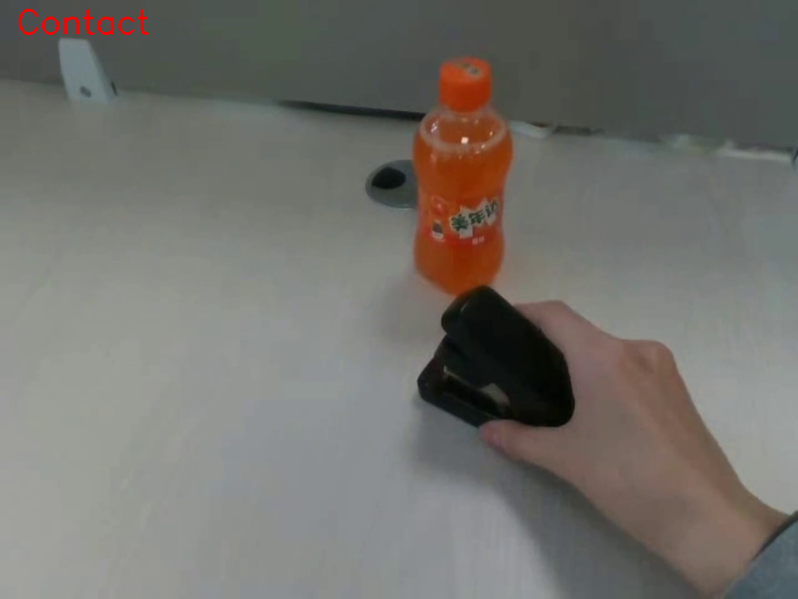
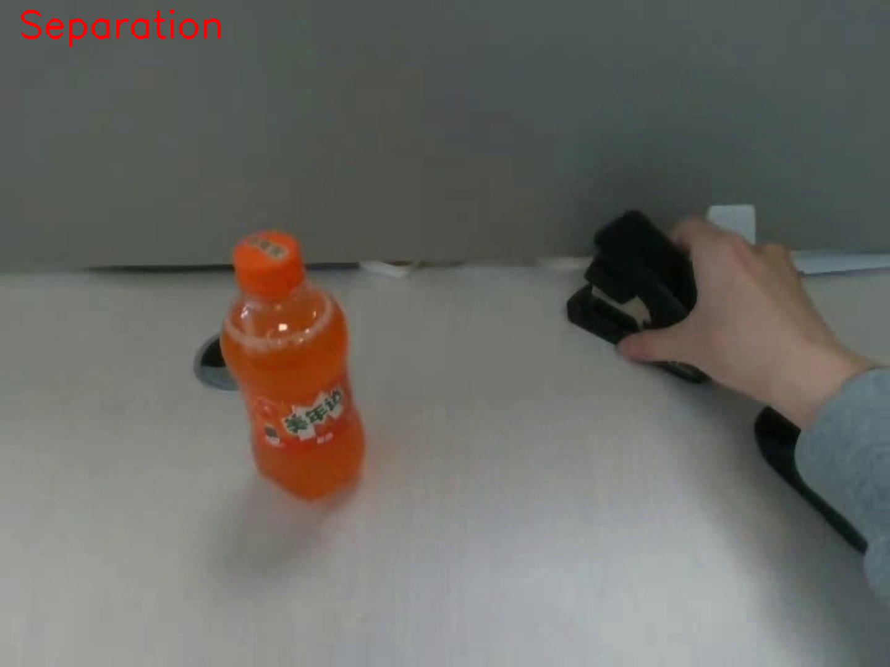

# EgoLoc: Zero-Shot Temporal Interaction Localization for Egocentric Videos

**Authors**: [Erhang Zhang#](https://scholar.google.com/citations?user=j1mUqHEAAAAJ&hl=en), [Junyi Ma#](https://github.com/BIT-MJY), [Yin-Dong Zheng](https://dblp.org/pid/249/8371.html), [Yixuan Zhou](https://ieeexplore.ieee.org/author/37089460430), [Hesheng Wang\*](https://scholar.google.com/citations?user=q6AY9XsAAAAJ&hl)

<div align="center">
 
</div>

---

**EgoLoc** is a vision-language model (VLM)-based framework that localizes **hand-object contact and separation timestamps** in egocentric videos in a **zero-shot** manner. Our approach extends the traditional scope of *temporal action localization (TAL)* to a finer level, which we define as *temporal interaction localization (TIL)*.

📄 [Read our paper](https://arxiv.org/abs/2506.03662) – accepted at **IROS 2025**.

<div align="center">
 <h3>
 from <font color="blue">[🧭TAL]</font> to <font color="red">[🎯TIL]</font>
 </h3>
 
</div>

We greatly appreciate [Yuchen Xie](https://github.com/yuchenxie4645) for helping organize our repository.

---

## 1. Getting Started

> We provide two demo videos from the [EgoPAT3D-DT dataset](https://github.com/oppo-us-research/USST) for quick experimentation.

---

### 1.1 EgoLoc & Grounded-SAM Environment setup & dependency installation 🚀

#### EgoLoc One-Liner Installation - **For Conda**

```bash
conda create -n egoloc python=3.10 -y && conda activate egoloc && \
git clone https://github.com/IRMVLab/EgoLoc.git && cd EgoLoc && \
pip install -r requirements.txt
```

<details>
<summary><strong>Grounded-SAM Dependency Installation</strong> (Mandatory)</summary>

#### Step 1 – Clone Grounded-SAM (with submodules)

```bash
git clone --recursive https://github.com/IDEA-Research/Grounded-Segment-Anything.git
```

If you plan to use **CUDA** (recommended for speed) *outside* Docker, set:

```bash
export AM_I_DOCKER=False
export BUILD_WITH_CUDA=True          # ensures CUDA kernels are compiled
```

#### Step 2 – Build Grounded-SAM components

```bash
# 4-A  Segment Anything (SAM)
python -m pip install -e Grounded-Segment-Anything/segment_anything

# 4-B  Grounding DINO
pip install --no-build-isolation -e Grounded-Segment-Anything/GroundingDINO
```

#### Step 3 – Vision-language extras

```bash
# Diffusers (for prompt-based image generation; optional but handy)
pip install --upgrade 'diffusers[torch]'
```

#### Step 4 – OSX module (object-centric cross-attention)

```bash
git submodule update --init --recursive
cd Grounded-Segment-Anything/grounded-sam-osx
bash install.sh          # compiles custom ops
cd ../..                 # return to project root
```

#### Step 5 – RAM & Tag2Text (open-vocabulary tagger)

```bash
git clone https://github.com/xinyu1205/recognize-anything.git
pip install -r recognize-anything/requirements.txt
pip install -e recognize-anything/
```

#### Step 6 – Optional utilities

```bash
pip install opencv-python pycocotools matplotlib onnxruntime onnx ipykernel
```

> These are needed for COCO-format mask export, ONNX export, and Jupyter notebooks.

#### Step 7 – Download pretrained weights (place inside `Grounded-Segment-Anything`)

```bash
cd Grounded-Segment-Anything

# Grounding DINO (Swin-T, object-grounded captions)
wget https://github.com/IDEA-Research/GroundingDINO/releases/download/v0.1.0-alpha/groundingdino_swint_ogc.pth

# Segment Anything (ViT-H)
wget https://dl.fbaipublicfiles.com/segment_anything/sam_vit_h_4b8939.pth
```

#### Step 8 – Download BERT backbone (for text embeddings) <-- Download Within the Grounded Segment Anything Repo


```bash
git clone https://huggingface.co/google-bert/bert-base-uncased
```

</details>

---

### 1.2 EgoLoc 3D-Specific Required Dependencies

<details>
<summary><strong>Quick installation (extra steps for the 3D demo)</strong></summary>

```bash
# ---- inside the EgoLoc root --------------------------------------------------
# 1) external repos
git clone https://github.com/geopavlakos/hamer.git
git clone https://github.com/DepthAnything/Video-Depth-Anything.git

# 2) python packages
# Install HaMeR dependencies (Note: MANO model is NOT required for this installation)
# Install VDA dependencies
pip install opencv-python matplotlib scipy tqdm

# 3) Get Video-Depth-Anything checkpoint
```

</details>
> Note: the VDA-based 3D demo is still under developmental phase, if any bugs are spotted please do not hesitate to make a PR. 

---

### 1.3 Known Bugs (With the assumption of successfull installation of all dependecies)

1. If you encounter a module error regarding segment_anything, please add a `__init__.py` file inside the directory of ./Grounded-Segment-Anything/segment_anything with the following:

```python
from .segment_anything import SamPredictor, sam_model_registry
```

If you encounter a bug, please do not hesitate to make a PR.

---
## 2. Running EgoLoc

> We provide 2 demos for you to test out. 

### 2.1 Running EgoLoc-2D (RGB Video + Non-Synthetic Depths Data)

We provide two example videos to demonstrate how our 2D version of EgoLoc performs in a **closed-loop** setup.
To run the demo:

```bash
python egoloc_2D_demo.py \
  --video_path ./video1.mp4 \
  --output_dir output \
  --config Grounded-Segment-Anything/GroundingDINO/groundingdino/config/GroundingDINO_SwinT_OGC.py \
  --grounded_checkpoint Grounded-Segment-Anything/groundingdino_swint_ogc.pth \
  --sam_checkpoint Grounded-Segment-Anything/sam_vit_h_4b8939.pth \
  --bert_base_uncased_path Grounded-Segment-Anything/bert-base-uncased/ \
  --text_prompt hand \
  --box_threshold 0.3 \
  --text_threshold 0.25 \
  --device cuda \
  --credentials auth.env \
  --action "Grasping the object" \
  --grid_size 3 \
  --max_feedbacks 1
```

The temporal interaction localization results will be saved in the `output` directory.

| Video      | Contact Frame                                             | Separation Frame                                             |
| ---------- | --------------------------------------------------------- | ------------------------------------------------------------ |
| **video1** |  |  |
| **video2** |  |  |

> **Note**: Due to inherent randomness in VLM-based reasoning, EgoLoc may produce slightly different results on different runs.

---

### 2.2 Running EgoLoc-3D (RGB Video + Auto Synthetically Generated Depths Tensor)

We provide 1 example video to demonstrate our 3D version of EgoLoc performs in a **closed-loop** setup. [VDA](https://github.com/DepthAnything/Video-Depth-Anything.git) is used here to synthesize pseudo depth observations, eliminating the reliance on RGB-D cameras for more flexible applications.
To run the demo:
```bash
python egoloc_3D_demo.py \
          --video_path video3.mp4 \
          --output_dir output \
          --device cuda \
          --credentials auth.env \
          --encoder vits \
          --grid_size 3
```

The temporal interaction localization results will be saved in the `output` directory. 


| Video      | Pseudo Depth  | Contact Frame    | Separation Frame      |
| ---------- | --------------------------------------------------------- | --------------------------------------------------------- | ------------------------------------------------------------ |
| **video3** |  |  |  |


> **Note**: Due to inherent randomness in VLM-based reasoning, EgoLoc may produce slightly different results on different runs.

---

### 3. Configuration Parameters

Here are some key arguments you can adjust when running EgoLoc.
For file paths related to GroundedSAM, please refer to its [original repository](https://github.com/IDEA-Research/Grounded-Segment-Anything).

* **video\_path**: Path to the input egocentric video
* **output\_dir**: Directory to save the output frames and results
* **text\_prompt**: Prompt used for hand grounding (e.g., `"hand"`)
* **box\_threshold**: Threshold for hand box grounding confidence
* **grid\_size**: Grid size for image tiling used in VLM prompts
* **max\_feedbacks**: Number of feedback iterations
* **credentials**: File containing your OpenAI API key

---

We plan to release a full version of EgoLoc and additional benchmarks soon.
In the future, we will also show:

* How to integrate EgoLoc with state-of-the-art hand motion forecasting frameworks like [MMTwin](https://github.com/IRMVLab/MMTwin)
* How to deploy EgoLoc in robotic manipulation tasks

But for now, feel free to explore the demos — and try it out on your own videos!

---

## 4. Citation

🙏 If you find EgoLoc useful in your research, please consider citing:

```bibtex
@article{zhang2025zero,
  title={Zero-Shot Temporal Interaction Localization for Egocentric Videos},
  author={Zhang, Erhang and Ma, Junyi and Zheng, Yin-Dong and Zhou, Yixuan and Wang, Hesheng},
  journal={arXiv preprint arXiv:2506.03662},
  year={2025}
}
```

---

## 5. Our Future Roadmap

* [ ] Add support for **3D hand motion analysis** *(within 2 weeks)*
* [ ] Extend to **long untrimmed videos** *(before IROS 2025)*
* [ ] Improve efficiency of the **feedback loop mechanism** *(before IROS 2025)*

---

**We appreciate your interest and patience!**

## 6. License

Copyright 2025, IRMV Lab, SJTU.

This project is free software made available under the MIT License. For more details see the LICENSE file.
